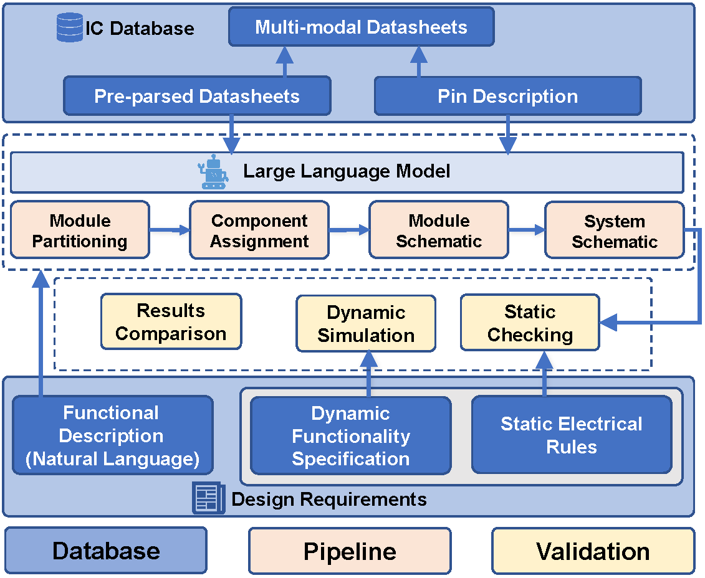

<div align="center">
  <h1>⚡ HWE-Bench</h1>
  <p><b>Can Language Models Perform Board-level Schematic Designs?</b></p>

  Code and data for the following work:
  <p>
    * [Conference 2026] <a href="https://arxiv.org/html/2603.18102v1">HWE-Bench: Can Language Models Perform Board-level Schematic Designs?</a>
  </p>
</div>

---

> **HWE-Bench** is a first-of-its-kind, end-to-end automated benchmark framework designed to systematically evaluate the real-world engineering capabilities of Large Language Models (LLMs) in the field of **Board-level Schematic Design**.
This project goes beyond testing LLM text generation; it implements a fully automated "datasheet-to-physical-verification" pipeline through rigorous static topological rule checking and dynamic SPICE transient simulation.

---

## ✨ Key Features
📄 Data Extraction: Powered by the MinerU engine, it performs high-fidelity parsing of unstructured PDF datasheets, automatically extracting core component parameters and pin networks to build machine-readable JSON component libraries.

🧠 Generation Pipeline: A standardized testing pipeline for evaluating LLM reasoning across core hardware design stages, including module partitioning, component selection, module-level connectivity, and system-level netlist integration.

🔬 Evaluation & Verification: Features a built-in dual-verification engine:

1. Static Rules Engine: Precisely verifies MCU pin allocation conflicts, bus matching, and point-to-point connectivity topology.

2. Dynamic SPICE Engine: Automatically generates .net simulation netlists and invokes LTspice to perform voltage/current limit tests across multi-stage state machines (e.g., power-up, self-locking, and shutdown).

---


🛠 Overall Architecture
The diagram below illustrates the comprehensive workflow of the HWE-Bench system, detailing how it automates the design and validation process from IC component extraction to final schematic verification.

<p align="center">



<em>Fig. 1: The overall architecture of HWE-Bench.</em>
</p>


##  Installation & Setup

### 1. Basic Dependency Installation
Ensure Python 3.8 or higher is installed. Open your terminal and execute the following command:

```bash
pip install pymupdf openai 
```

### 2. Resources 
| Category |	Name |	Link |
| :--- | :--- | :--- |
| **Core Engine** | **MinerU** | [🔗 GitHub - opendatalab/MinerU](https://github.com/opendatalab/MinerU) |
| **Tools** | **LTspice Simulator** | [🔗 Analog Devices](https://www.analog.com/en/design-center/design-tools-and-calculators/ltspice-simulator.html) |

### 3. Repository Structure
```
HWE-bench/
├── Datasets/
│   └── Consumer/Bathroom Fan/
│       ├── datasheet/                # Original component PDF datasheets
│       ├── output/                   # Evaluation artifacts and model outputs
│       │   ├── pdf/                  # Processed PDF data
│       │   ├── result/               # Evaluation results
│       │   ├── rules.json            # Design ground truth rules
│       │   ├── spice_*.py            # Module simulation script
│       │   └── static_rules.py       # Static topology verification script
│       ├── introduce.txt             # Task description and requirements
│       └── sche.png                  # Reference schematic image
├── mineru/                     # Phase 1: Data Parsing and Structuring Engine
│   ├── pdf2md.py
│   ├── pdf_md2txt.py
│   └── pdf_json.py
├── pipeline/                   # Phase 2: LLM Hardware Design and Generation Pipeline
│   ├── 1Module Partitioning.py
│   ├── 2Component Assignment.py
│   ├── 3Module Schematic.py
│   └── 4System Schematic.py
└── README.md
```
##  🚀Quick Start
### Phase 1: Data Extraction 
Convert unstructured PDFs into an LLM-readable JSON component library.

```bash
cd mineru
python pdf2md.py      # Invoke MinerU engine for high-fidelity Markdown conversion
python pdf_md2txt.py  # Invoke LLM to extract core parameters and pin tables
python pdf_json.py    # Package data into a standard JSON knowledge base using regex
```

### Phase 2: Generation Pipeline
Drive the LLM to complete the system design step-by-step using the extracted knowledge base.

```bash
cd ../pipeline
python "1Module Partitioning.py"  # Generate functional module definitions
python "2Component Assignment.py" # Intelligently assign specific components
python "3Module Schematic.py"     # Generate module-level connectivity netlists
python "4System Schematic.py"     # Integrate and generate the full System Netlist
```

### Phase 3: Evaluation & Verification 
Perform rigorous scoring and physical verification of the generated circuit netlists.

```bash
# Static Rules: Precisely verify MCU pin conflicts, bus matching, and point-to-point topology
python static_rules.py

# Dynamic Simulation: Automatically assemble .net netlists and invoke LTspice for multi-stage state machine stress testing
python spice_*.py
```

## 📑 Citation

If you find this work helpful in your research, please cite:

```bibtex
@article{qiu2026hwebench,
  title={HWE-Bench: Can Language Models Perform Board-level Schematic Designs?},
  author={Weibo Qiu, Yinhao Xiao, Runyu Pan},
  journal={arXiv preprint arXiv:2603.18102},
  year={2026}
}